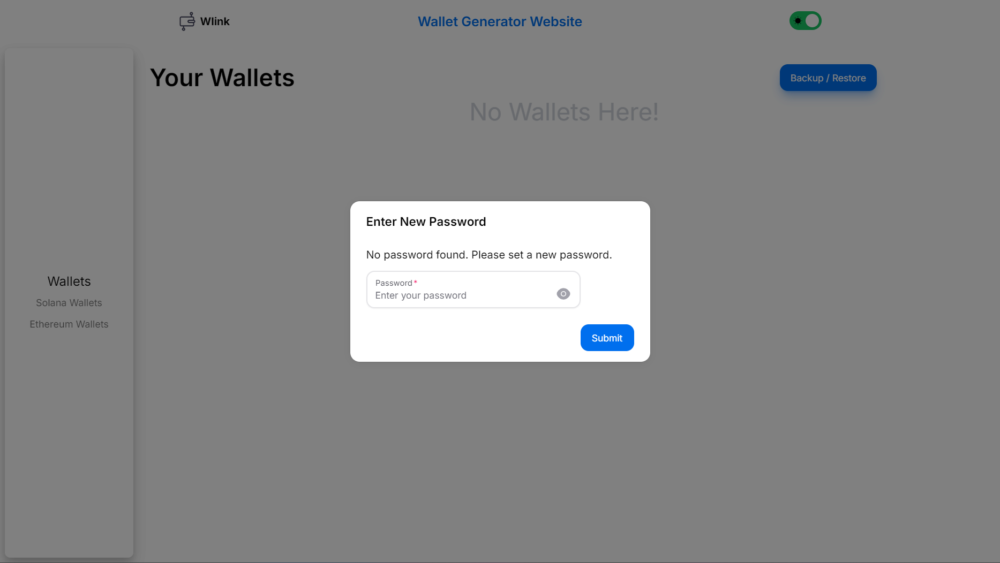

# W-Link Key Generator

Welcome to the **W-Link Key Generator**! This web application allows users to generate, encrypt, and manage Solana and Ethereum wallet keys securely.

## Live Demo

You can access the live version of the application here: [W-Link Key Generator](https://w-link-key-generator.vercel.app)

When you visit the website for the first time it will through a prompt at you saying.   `No Password found. Please set a new password`



Just set the password and you are in!

for visiting the second time just putup your set pin.

## Features

- **Generate Solana and Ethereum Wallets**: Easily create new Solana or Ethereum wallet with a single click.
- **Encrypt Private Keys**: Securely encrypt your private keys with a password.
- **Backup and Restore Wallets**: Download encrypted backups of your wallets and restore them when needed.
- **Manage Multiple Wallets**: Store and manage multiple Solana  and Ethereum wallets locally in your browser.

## Technologies Used

- **Frontend**: React.js, Next.js
- **Styling**: TailwindCSS
- **Animations**: Framer Motion
- **Cryptography**: `@noble/ed25519`, `crypto`, `aes-js`
- **Icons**: Lucide React

## Getting Started

To get started with the project locally, follow these steps:

### Prerequisites

Make sure you have the following installed:

- Node.js (v14 or higher)
- npm or yarn

### Installation

1. Clone the repository:
   ```bash
   git clone https://github.com/your-username/w-link-key-generator.git
   cd w-link-key-generator
   ```

2. Install dependencies:
   ```bash
   npm install
   # or
   yarn install
   ```

3. Create a `.env` file in the root directory and add the following environment variable:
   ```
   ALCHEMY_API_KEY=your_alchemy_api_key
   ```

4. Start the development server:
   ```bash
   npm run dev
   # or
   yarn dev
   ```

5. Open your browser and navigate to `http://localhost:3000` to view the application.

## Usage

### Generate a Wallet

1. Navigate to the "Solana Wallet" or "Ethereum Wallet" section.
2. Put up the mnemonic pharase or leave it blank, put the wallet name(required).
3. Click the "Generate" button to create a new wallet.
4. The generated wallet details, including the public key and encrypted private key, will be displayed.
5. Go back to wallets section and your newly generated wallet will be there.
### Encrypt & Store Private Keys

1. After generating a wallet, you can encrypt the private key using a password.
2. The encrypted key is stored in the browser's local storage for secure access.

### Backup & Restore

- **Backup**: Click the "Backup" button to download a JSON file containing all your encrypted wallet data.
- **Restore**: Upload a previously downloaded backup file to restore your wallets.

## Folder Structure

The project follows a typical Next.js structure:

```
.
├── src/
│   ├── app/
│   │   ├── api/
│   │   │   └── fetchBalance/route.js
│   │   ├── components/
│   │   ├── pages/
│   │   ├── styles/
│   │   └── utils/
├── public/
├── .env
├── .gitignore
├── package.json
└── README.md
```

## Contributing

Contributions are welcome! If you'd like to contribute to this project, please follow these steps:

1. Fork the repository.
2. Create a new branch: `git checkout -b feature/your-feature-name`.
3. Make your changes and commit them: `git commit -m 'Add some feature'`.
4. Push to the branch: `git push origin feature/your-feature-name`.
5. Open a pull request.

## License

This project is licensed under the MIT License.

